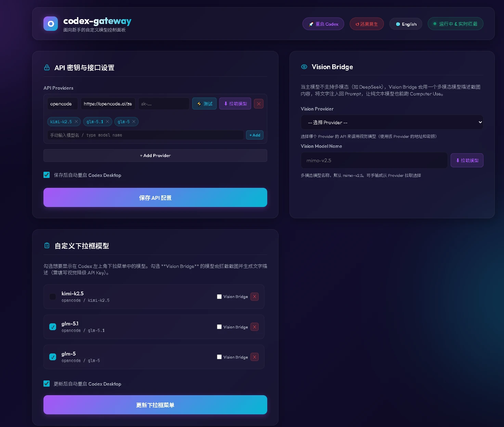

# codex-gateway 🚀

[English](#english) | [简体中文](#简体中文)

<p align="center">
  
</p>

<p align="center">
  <a href="https://youtu.be/GvmXBZvvhuo">▶️ Watch Demo Video on YouTube</a>
</p>

---

# English

**codex-gateway** is a plug-and-play local gateway that unlocks Codex Desktop for third-party APIs, featuring a premium web dashboard, custom Computer Use engine, and Vision Bridge for text-only models.

## 🌟 Key Features

* **Zero-Config Setup**: Start the server, it auto-patches `~/.codex/config.toml` with backups. No CLI, no manual editing.
* **Premium Web Dashboard** (`http://localhost:8765/dashboard`):
  * 🌐 Bilingual (EN/中文) with instant switch
  * 🔑 API key & endpoint management
  * 📝 Add/delete custom models, toggle visibility in Codex
  * 📡 Live SSE log streaming
  * 🚀 One-click Codex restart
  * ↺ One-click reset to native Codex
* **Custom Computer Use Engine**:
  * 🖱️ Native macOS mouse/keyboard/window control via CGEvent
  * 📸 Screenshot capture with `sips` compression (1200px)
* **Vision Bridge**:
  * 👁️ For text-only models (DeepSeek, etc.)
  * Automatically compresses screenshots, describes via multimodal model, injects description into prompt
  * Supports any OpenAI-compatible vision model (configurable endpoint, model, API key)

## 🚀 Quick Start

### Prerequisites
- macOS
- Node.js v18+
- Codex Desktop installed

### Install & Run

```bash
git clone https://github.com/AITabby/codex-gateway.git
cd codex-gateway
npm install
npm start
```

Server starts, browser opens to the dashboard. Add your API key and model names, click save — done.

---

# 简体中文

**codex-gateway** 是一款即插即用的本地网关，为 Codex Desktop 解锁第三方 API。配备高颜值 Web 控制台、自研 Computer Use 引擎，以及让纯文本模型也能看图操作的 Vision Bridge。

## 🌟 核心特性

* **零配置启动**：启动后自动修补 `~/.codex/config.toml`，无需任何操作。
* **高颜值 Web 控制台**（`http://localhost:8765/dashboard`）：
  * 🌐 中英文一键切换
  * 🔑 图形化管理 API Key 和接口地址
  * 📝 自由增删模型，勾选控制哪些显示在 Codex
  * 📡 实时 SSE 日志流
  * 🚀 一键重启 Codex
  * ↺ 一键还原原生 Codex
* **自研 Computer Use 引擎**：
  * 🖱️ macOS 原生鼠标/键盘/窗口控制（CGEvent）
  * 📸 截图自动 `sips` 压缩至 1200px
* **Vision Bridge 视觉降级**：
  * 👁️ 纯文本模型（DeepSeek 等）也能跑 Computer Use
  * 自动压缩截图 → 多模态模型描述 → 注入文字到 Prompt
  * 支持任意 OpenAI 兼容的多模态模型（可配接口、模型名、Key）

## 🚀 快速上手

### 准备工作
- macOS 系统
- Node.js v18+
- 已安装 Codex Desktop

### 安装与启动

```bash
git clone https://github.com/AITabby/codex-gateway.git
cd codex-gateway
npm install
npm start
```

启动后浏览器自动打开控制台，填写 API Key 和模型名，保存即可使用。
